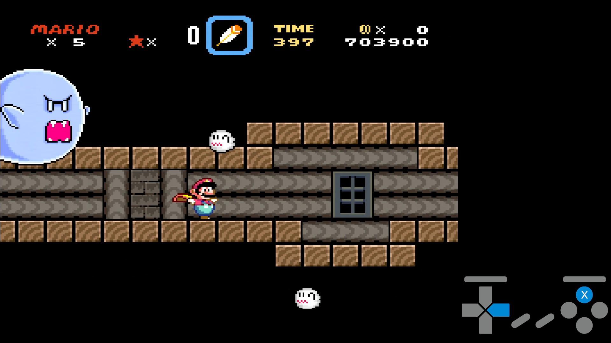
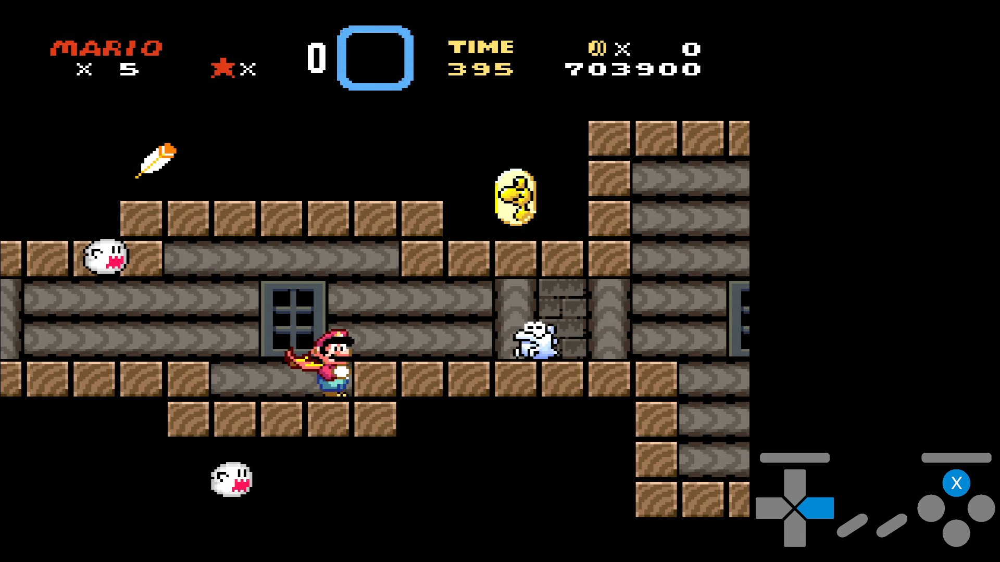
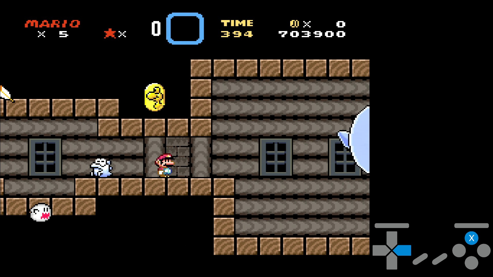
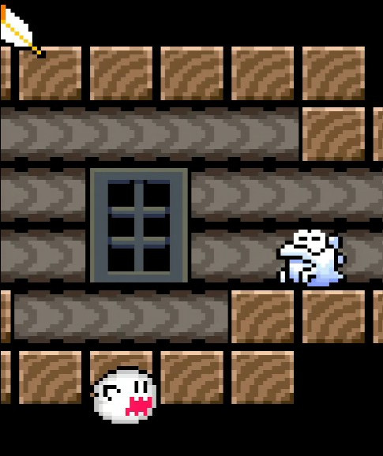
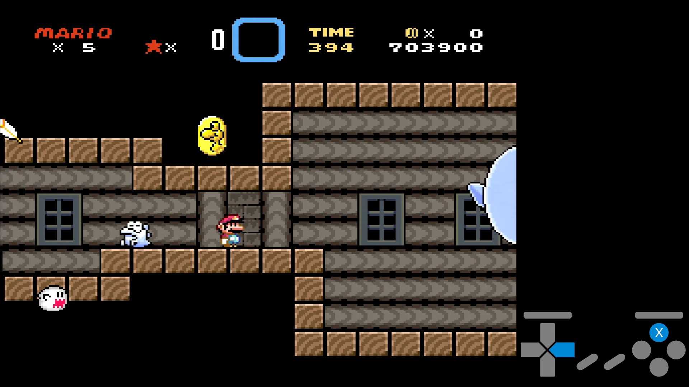
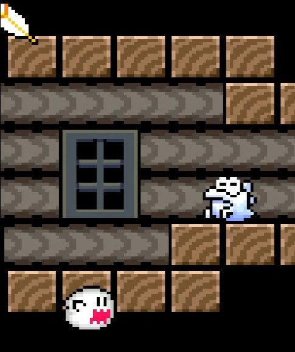

# FGHClipセットアップ

「まよいのもりのオバケやしき」で出来る短縮技、FGHClipのセットアップ解説。

[参考動画](https://youtu.be/oWDUZyYEDY4)

# 目次
* [概要](#概要)
* [セットアップ](#セットアップ)
* [おまけ](#おまけ-右のドアの場合)
* [あとがき](#あとがき)

## 概要

- コース: まよいのもりのオバケやしき
- 短縮量: 約13秒 (右のドアの場合、約7秒)
- 条件: スーパーマリオ以上の状態で、マントをストックアイテムとして持っていること。

## セットアップ

### 1. ストックアイテムを落とす

コース開始後、右へダッシュして画像の位置でストックアイテムを落とす。

猶予は2~3F。

### 2. 段差で少し待ってから進む

段差から降りた後も右入力を続け、テレサウルスの位置を目印にスピンジャンプする。

以下の画像のようにテレサウルスの目に背景の縦線が刺さるようなタイミングがおすすめ。
 

スピンジャンプのAボタン入力量は1F。条件付きで2F（次項に関係する）。

### 3. ポーズを使いつつ切り返す

テレサウルスに被弾後、ポーズをかける。

ポーズをかけているのは、1Fでの切り返しを安定させるため。

入力イメージとして、

- ✅成功例: → → → → ← ←
- ❌失敗例: → → → → 入力なし 入力なし ← ←

となる。

以下の画像のように、画面左端のブロックの木目の色が少しだけ見えるようにする。

#### 1st frame

あるいは、次のフレームでのポーズも有効。

#### 2nd frame

ただし、Aボタンの入力量が2Fの場合は **[1st frame](#1st-frame)のみ**が有効。（つまり、ポーズ猶予は1Fになる。）

目印を確認して、問題がなければ左入力を押したまま、ポーズを解除する。

もし、目印よりも手前でポーズをかけた場合、ずれたF分ポーズ後も右入力を続けて切り返すことでリカバリが効くが、切り返しの際に無入力Fがあると失敗する。

### 4. 段差から降りてジャンプし、天井を抜ける。

切り返したら、段差を降りる。

着地した次のフレーム(猶予1F)でスピンジャンプする。

セットアップが成功していれば、天井を抜けることができる。

## おまけ: 右のドアの場合

右のドアの場合、テイクオフメーターを残してドアに入ることができる。

参考動画: [YouTube](https://youtu.be/E5SS_PoZ_iQ?si=RM22WL1w4TKRpgfB)

## あとがき

セットアップが作れたのは個人的に結構大きな功績だと思っている。
いい形にできてよかった。

[個人配信](https://twitch.tv/rickyye_)での記録狙いでも、通しだったら3回に1回は決まる程度の成功率まで持って行けた。